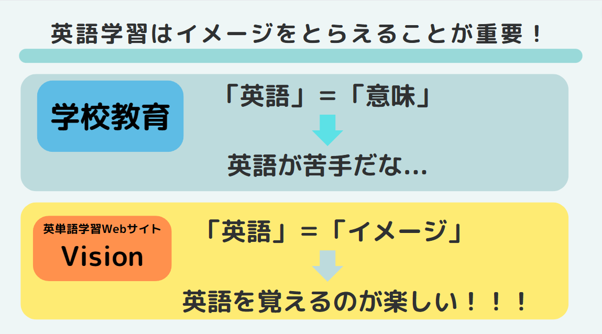
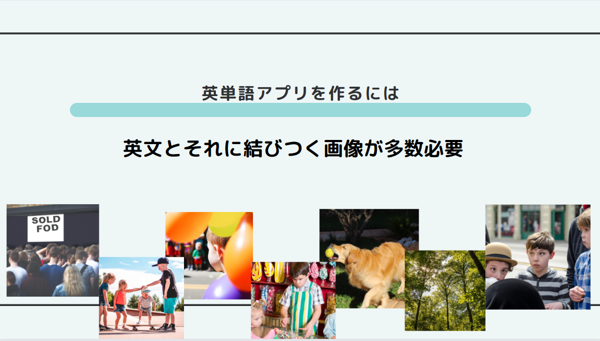
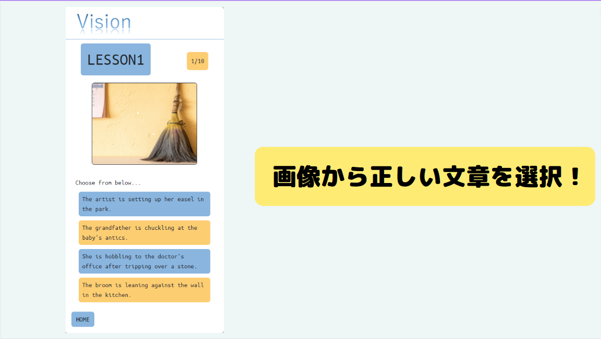
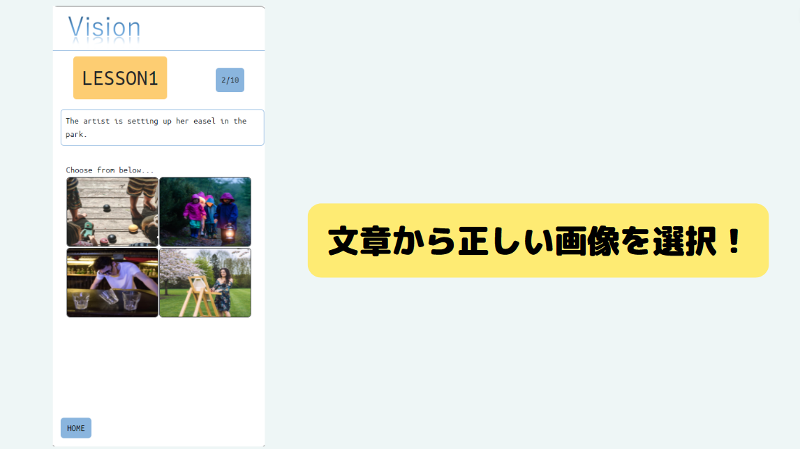

# VISION アプリケーション

visionアプリケーションへようこそ。<br>
英単語を日本語を返すことなく英語のまま勉強しましょう。

## VSIONアプリケーションのURL

ぜひ実際に試してみてください。

URL :     https://run-sql-pt77xoh4la-an.a.run.app/

## 作成背景
英語の教育はイメージをとらえることが重要になります。



現在の学校教育は英単語を意味で覚えます。しかし、それではたくさんある英単語の意味を覚える必要があり、暗記作業の意味合いが強くなります。これでは英語を勉強することが嫌いになってしまいます。

そこで英語と画像を結びつける英語学習アプリケーションを作ることによって英語をイメージで覚えることを可能にします。これによって英語を暗記する作業の感覚が軽減され、英語を楽しく覚えることが可能になると考えました。




英語と画像で問題を作成するには当然たくさんの画像が必要になります。しかし、人力で画像を用意することは労力を考えると現実的ではないです。

そこで近年、技術が発展している生成AIを使用することによって問題文と画像を生成し、問題作成の労力を軽減します。
プロンプトエンジニアリングに工夫をすることでCEFR（セファール）という外国語運用能力の指標別に問題文と画像を生成できるようにしました。

## 概要

２種類の問題形式を実装しています。

* 画像から正しい文章を選択する
* 文章から正しい画像を選択する




使用技術 : Node.js, react, firebase, cloud run, cloud sql

## 注力した機能

今後記入する
## ログインのためのテストアカウント

今後記入する

## 環境構築

**このアプリケーションはdockerを使用します** 

適当なディレクトリに移動しこのリポジトリをクローンしてください

```bash
git clone git@github.com:kankitakahiro/english_learning_app.git
```

その後クローンしたディレクトリに移動し以下のコマンドでdockerのコンテナを起動することができます。

```bash
docker-compose up -d
```

ローカル環境の場合 http://localhost:3000/ でアプリケーションにアクセスできます。

## 開発者の方
サーバーへのアクセス<br>
node http://localhost:8080/ <br>
react http://localhost:3000/

dockerコンテナへのアクセス
```bash
docker exec -it node /bin/bash  # node コンテナ
docker exec -it react /bin/bash # react コンテナ
docker exec -it db /bin/bash    # db コンテナ
```

## 目標
- ログイン (引き継ぎ) -> 名前, 進捗とか表示させる (kido)
- ユーザーのオリジナルの画像 upload (front:kido, back:yamamoto)
- エラー直す, リファクタリング -> 問題文 list(yamamoto)

---

金曜日に時間があれば
- 画像の修正
- 音声 ??

